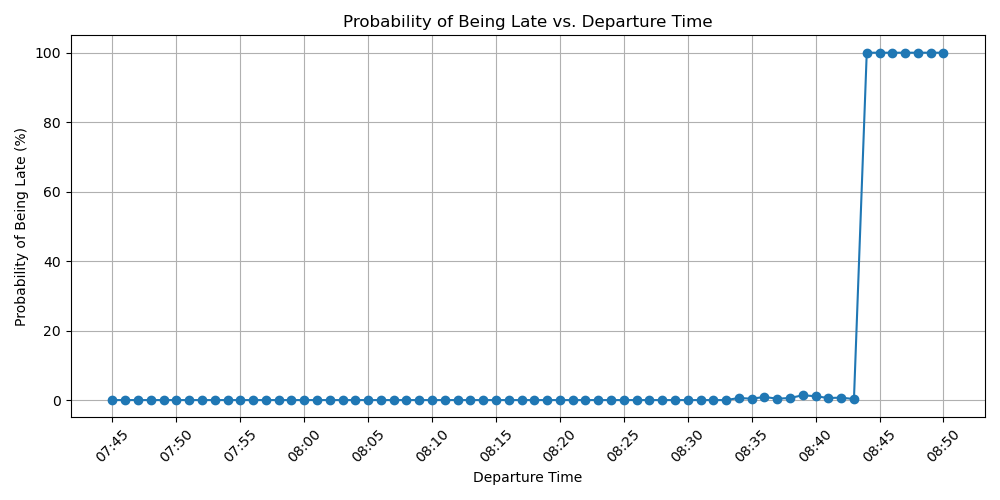

# Rita's Bus Journey Simulation

---

##  Project Overview

This project simulates Rita's daily bus journey to her meeting at the RMK Tallinn office. The core challenge is to calculate and visualize the probability of her being late, depending on her departure time from home. This involves considering fixed walking times, a defined bus schedule, and realistic random elements like bus delays and varying ride durations.

## Overall approach

The project aims to implement a modular Monte Carlo Simulation, where you could easily integrate additional functions for varying degrees of randomness.
The simulation is only as accurate as the modeled scenarios. The entire simulation computes values from fictional midnight in seconds. Near every value used in computing is in seconds from midnight, which means this simulation only supports computation in less than 24 hour timeframes. To modify it to multiple day simulation, fictional midnight would need to switched out for datetime objects reflecting real time.


This solution was developed as part of the RMK Data Team Internship Test Challenge 2025.

## Key modelled assumptions

 - Rita always walks exactly five minutes from home to departure bus stop ZOO.
 - The bus never leaves the station early even is it hypothetically arrives early (which is why she still always makes the last bus when she leaves 08:43).
 - The bus can run late at most 2 minutes exactly.
 - The bus driving time can be anywhere from 8 to 12 minutes with a bias toward the upper range.
 - Rita always walks from destination bus stop to meeting exactly 4 minutes

##  Features

* **Monte Carlo Simulation:** Uses a probabilistic simulation approach to estimate lateness probabilities.
* **Realistic Randomness:** Incorporates random bus delays and ride times, modeled with a **triangular distribution**, reflecting common real-world variabilities.
* **Defined Bus Schedule:** Accurately integrates Rita's interaction with a fixed Tallinn city bus schedule.
* **Time Utilities:** Includes a function for converting seconds from midnight into a human-readable HH:MM format.
* **Data Visualization:** Generates a **`matplotlib` plot** that clearly illustrates the probability of lateness across different departure times.
* **Automated Testing:** Features a suite of **`pytest` unit tests** to ensure the simulation's logic is sound and reliable.
* **GitHub Actions CI:** Configured to automatically run tests on every code push and pull request to the `main` branch, ensuring continuous quality assurance.

## Output of the simulation



##  Technologies Used

* **Python 3.12**
* **`random`** (standard library)
* **`matplotlib`**
* **`pytest`**
* **`unittest.mock`** (standard library)
* **GitHub Actions**

---

##  Setup and Installation

To get this project up and running on your local machine, follow these steps:

1.  **Clone the Repository:**

2.  **Create a Virtual Environment (Recommended):**
    Using a virtual environment helps manage project dependencies cleanly.
    ```bash
    python -m venv venv
    ```

3.  **Activate the Virtual Environment:**

    * **On macOS/Linux:**
        ```bash
        source venv/bin/activate
        ```
    * **On Windows (Command Prompt):**
        ```bash
        venv\Scripts\activate.bat
        ```
    * **On Windows (PowerShell):**
        ```powershell
        .\venv\Scripts\Activate.ps1
        ```

4.  **Install Dependencies:**
    Install all necessary Python packages:
    ```bash
    pip install -r requirements.txt
    ```

---

##  How to Run the Simulation

Once set up, running the simulation is straightforward:

1.  Ensure your virtual environment is active.
2.  Execute the `main.py` script:
    ```bash
    python main.py
    ```
    This command will print the calculated probabilities of Rita being late for various departure times to your console. Additionally, it will save a plot named `late_probabilities.png` in your project's root directory.

---

##  How to Run Tests

The project includes a suite of tests to verify the simulation's core logic.

1.  Ensure your virtual environment is active.
2.  Run `pytest` from the project's root directory:
    ```bash
    pytest
    ```
    This will execute all tests defined in `test_main.py`.

### Testing Philosophy

* **Deterministic Boundaries:** I've included tests that confirm Rita is **always on time** when departing extremely early, or **always late** when departing extremely late. These are boundary conditions where the outcome should be consistent, regardless of the random factors.
* **Focused Testing:** Functions that solely generate random numbers (e.g., `generate_bus_delay`) or involve only simple iteration logic (e.g., `simulations_per_departure`, `run_simulation_over_range`) are not directly unit-tested.

---

##  Code Structure

* `main.py`: Contains all the core simulation logic, including constants, utility functions, the simulation steps, and the main execution function for running the simulation and plotting results.
* `test_main.py`: Houses the `pytest` test suite, designed to test the functions within `main.py`.
* `.github/workflows/python-tests.yml`: Configures the **GitHub Actions** workflow, setting up automated test runs on every push and pull request to the `main` branch.
* `requirements.txt`: Lists all external Python dependencies required for the project to run.
* `late_probabilities.png`: The visual output of the simulation, generated by `main.py` (will appear after the first run).

---

##  Assumptions and Simplifications

* **Fixed Schedule:** The bus schedule is static and the bus drivers adhere to it, aside from the randomized delay.
* **Constant Walk Times:** The time Rita takes to walk from home to the bus stop (300 seconds) and from the bus stop to the meeting (240 seconds) is fixed and unchanging.
* **Triangular Distribution:** Bus ride times and delays are modeled using a triangular distribution. This was chosen for its straightforward implementation and ability to represent skewed real-world probabilities (e.g., a mode value being more likely than extremes). For bus ride time the distribution is biased towards the upper range to accurately reflect that the bus is more likely to run late than be early.
* **Instant Transitions:** No time is accounted for bus boarding or alighting.
* **Single Transport Method:** Rita's only mode of transport to work is the specified bus number 8.

---

##  Contributing

Feel free to open issues or submit pull requests if you have suggestions or improvements!

---


